[TOC]

# Final Report

**小组成员**

* 田佳林 PB20061251
* 胡乐翔 PB19000165
* 高弋超 PB20051083
* 朱仕哲 PB20111718

## 1 项目简介

本项目基于 ROS 2 搭建一个分布式系统，并使用 Ray 提高系统的分布式性能，提高系统的并行度，从而提高 ROS 2 各个节点的性能和稳定性。

## 2 项目背景

### 2.1 分布式系统

#### 2.1.1 分布式系统简介

分布式系统（distributed system）由多台计算机和通信的软件组件通过计算机网络连接（本地网络或广域网）组成。

分布式系统(Distributed System)这个概念是相对于集中式系统来说的，简单而言，分布式系统指的是一组计算设备，这些计算机在物理上是分开的，在体系结构上可能是异构的，但是通过网络相互连接，形成一个统一的计算系统。分布式系统的各个计算机通过相互发送消息实现交流和协调。由于用户不能看到分布式系统的底层实现，所以分布式系统的各个计算设备对于用户而言是一个整体。

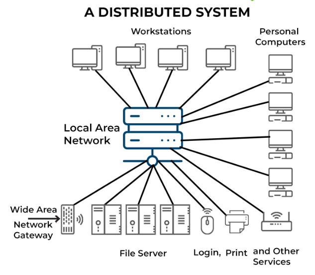

#### 2.1.2 分布式系统的背景

随着计算机网络的发展，程序需要用到的数据可能不再存在于单个的计算机上，例如，客户使用信用卡时，本地的机器可能只负责将数据发送到银行的计算机上，后者则进行验证和处理数据等工作。分布式系统所需的进程间通信的工作方式在 20 世纪 60 年代的操作系统研究中就已经涉及。最早的大范围的分布式系统是局域网，例如以台网。

另外，随着计算机科学的发展和广泛应用，计算的资源和对算力的需求不断增加，单个的计算设备无法存储所有的计算资源或提供需要的所有算力支持，需要多个计算设备协同工作才可以完成任务。

#### 2.1.3 分布式系统的架构

分布式系统有多种架构，比如:

* C/S 架构：多个客户端从服务器处请求数据并格式化显示给用户。在客户端提交的信息可以返回给服务器，来产生一个永久的修改。
* 三层架构：表现层，业务逻辑层，数据访问层。用户的请求在表现层提交，随后传送到业务逻辑层，在业务逻辑层进行验证，计算等工作后提交给数据访问层。数据访问层主要进行数据库的读写操作。
* P2P：没有独立提供服务或管理网络的特殊服务器。所有的任务都被统一在网络之中进行分配。每一个节点的低位都是平等的，并且都可以作为服务器和客户端，例如比特币网络就是通过 P2P 的分布式系统实现的。

#### 2.1.4 分布式系统的优点

* 增强算力，解决了可扩展问题。对于集中式系统，由于只有一台计算设备，所以在 CPU 和存储设备的单位算力/存储能力一定的情况下，只能通过在这台设备上堆叠 CPU 和存储器的方式提高数据的处理能力，这种方式称为垂直扩展(scale up)。但是这样的提升方式面临许多瓶颈，例如空间的限制，难以满足散热的需求，成本过高，还可能在硬件层面导致计算设备不可用(例如访存时间的增长可能导致在原来的 CPU 架构不能胜任工作)，因此提升的空间是极其有限的。
  如果采用分布式系统，将多台服务器通过网络连接在一起，称为水平扩展(scale out)。即使单台服务器的计算能力和存储能力很有限，整个分布式网络的计算能力也会随着网络中设备数量的增加而变得很可观。
  
* 提升系统的稳定性，解决了高可用问题。单台服务器面临着损坏的风险，即使没有意外情况发生，服务器也要进行定期的维护和系统升级。这时集中式系统就无法向客户进行服务；而分布式系统即使个别设备出现异常或停机，对整个分布式系统的影响也可能是很小的，通过合理的设计，我们可以让分布式系统的可用性接近 100%。在任何时段，都可以很好地处理用户的请求。
* 降低了数据的延迟。如果只有一台服务器，那么在距离这台服务器较远的位置请求服务数据可能需要较长的延迟。通过分布式系统的设计，我们可以在全球的不同位置部署服务器，用户在有数据访问的需求时只需访问离自己的设备距离最近的服务器即可，这样的设计可以极大地减小集中式系统的一体化带来的数据传输延迟。

#### 2.1.5 分布式系统的不足

* **数据的一致性** 考虑到大量的机器故障：宕机、重启、关机，数据可能丢失、陈旧、出错，如何让系统容纳这些问题，对外保证数据的正确性，需要相当复杂的设计。
* **网络和通信故障** 网络的不可靠，消息可能丢失、早到、迟到、Hang住，这给机器间的协调带来了极大的复杂度。像TCP等网络基础协议，能解决部分问题，但更多的需要系统层面自己处理。更不用说，开放式网络上可能存在的消息伪造。
* **管理复杂度** 机器数量到达一定数量级时，如何对他们进行有效监控、收集日志、负载均衡，都是很大挑战。
* **延迟** 网络通信延迟要比机器内通信高出几个数量级，而组件越多、网络跳数越多，延迟便会更高，这些最终都会作用于系统对外服务质量上。

### 2.2 ROS 2

ROS(Robot Operating Systems)是一个机器人领域的元操作系统，是一个分布式的通信框架，能够帮助进程间更方便地实现通信，协调一个机器人的各个部件或多个机器人组成的机器人集群完成任务。

#### 2.2.1 ROS vs ROS 2

为了达到简化机器人开发的设计目的，ROS 开发了一整天通讯机制，包括话题，服务参数和动作。为了将各个机器人节点连接起来并实现通信，ROS 引入了 `ROS Master`节点，所有节点的通讯必须经过这个主节点。

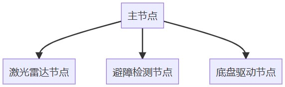

一旦`Ros Master`主节点挂掉后，就会**造成整个系统通信的异常**

ROS 存在以下缺点：

- 通信基于TCP实现，实时性差、系统开销大
- 对Python3支持不友好，需要重新编译
- 消息机制不兼容
- 没有加密机制、安全性不高

在 ROS 2 中，主节点被去掉了，ROS 和 经过改进的 ROS 2 的架构如图所示：

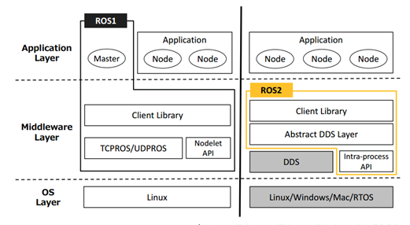

ROS 2 相对于 ROS 的改进有：

* 去中心化：ROS 2 取消了 master 节点。去掉 master 节点之后，各个 ROS 2 节点都是平等的，可以实现一对一，一对多，多对多通信。
* 通信使用 DDS 实现，使得 ROS2 的实时性，可靠性和连续性都有了增强。
* 实现了 python2 到 python3 的升级，编译系统由 catkin 换为 ament，C++ 标准更新至 C++11，进程内通信和进程间通信可以使用相同的 API。

#### 2.2.2 ROS 2 的节点之间的通信


### 2.3 Ray

#### 2.3.1 What is Ray?

Ray是伯克利大学RISELab研发的分布式计算系统。主要有以下的特点：

* 提供一种能够构建、运行分布式应用程序的 simple primiitves；
* 从单机扩展到平行，几乎不需要改代码；
* 拥有良好的生态，能够在core Ray上构建复杂的应用程序。

Ray 有两种计算原语：

* Task：一个无状态的计算任务（函数表示）。Ray允许异步执行任意函数，开销非常低，可以在毫秒内执行，并且可以自动向集群添加节点并调度任务，非常适合扩展计算密集型应用程序和服务。
* Actor：一个有状态的计算任务（类表示）。一个强大的异步编程范例，本质上是一个有状态的Worker，可以在本地和远程无缝工作。

#### 2.3.2 Ray API

通过 Ray 的六个 API 就可以完成绝大部分功能：

* `ray.init()`
  可以初始化 Ray，函数的参数可以用于调参；

* `@ray.remote`
  如果修饰函数，则该函数变为一个远程的 Task；如果修饰一个类，则该类变成一个远程的 Actor。
  例如，可以用以下方式定义一个远程的 Task：

  ```python
  @ray.remote
  def f2():
      n = 1200
      a = np.random.randint(0, 10, (n, n))
      b = np.random.randint(0, 10, (n, n))
      c = a @ b
  ```

  这样就生成了一个远程执行的Task。

* `x.remote`
  构造一个Actor实例，或是异步运行一个Task或Actor的方法。

* `ray.put()`
  将一个值放入分布式对象存储中
* `ray.get()`
  从分布式对象存储中获取一个对象，这个对象可以是由`ray.put`显式存入的，也可以是由Task或Actor方法存入的。这个方法会一直阻塞直到获取的对象可用。
* `ray.wait()`
  返回已准备好的ID列表和尚未准备好的ID列表。第一个列表由对象引用组成，这些对象引用与对象存储中可用的对象相对应。第二个列表对应于其余的对象引用（可能已准备就绪，也可能尚未准备就绪）

#### 2.3.3 Ray Architecture

Ray的架构由应用层和系统层组成，其中应用层实现了Ray的API，作为前端供用户使用，而系统层则作为后端来保障Ray的高可扩展性和容错性。整体的架构图如下图所示：


**应用层**

应用层中有三种类型的进程：

- **驱动器进程** (Driver Process): 执行用户程序的进程。顾名思义，所有操作都需要由主进程来驱动。
- **工作器进程** (Worker Process): 执行由驱动器或其他工作器调用的任务（远程函数）的无状态的进程。工作器由系统层分配任务并自动启动。当声明一个远程函数时，该函数将被自动发送到所有的工作器中。在同一个工作器中，任务是串行地执行的，工作器并不维护其任务与任务之间的局部状态，即在工作器中，一个远程函数执行完后，其局部作用域的所有变量将不再能被其他任务所访问。
- **行动器进程** (Actor Process): 行动器被调用时只执行其所暴露的方法。行动器由工作器或驱动器显式地进行实例化。与工作器相同的是，行动器也会串行地执行任务，不同的是行动器上执行的每个方法都依赖于其前面所执行的方法所导致的状态。

**系统层**

系统层由三个主要部件组成：全局控制存储器 (**G**lobal **C**ontrol **S**tore)、分布式调度器 (Distributed Scheduler)和分布式对象存储器 (Distributed Object Store)。这些部件在横向上是可扩展的，即可以增减这些部件的数量，同时还具有一定的容错性。

**GCS**

GCS设计的初衷是让系统中的各个组件都变得尽可能地无状态，因此GCS维护了一些全局状态：

- 对象表 (Object Table)：记录每个对象存在于哪些节点
- 任务表 (Task Table)：记录每个任务运行于哪个节点
- 函数表 (Function Table)：记录用户进程中定义的远程函数
- 事件日志 (Event Logs)：记录任务运行日志

**分布式调度器**

Ray中的任务调度器被分为两层，由一个全局调度器和每个节点各自的局部调度器组成。为了避免全局调度器负载过重，**在节点创建的任务首先被提交到局部调度器，如果该节点没有过载且节点资源能够满足任务的需求（如GPU的需求），则任务将在本地被调度，否则任务才会被传递到全局调度器**，考虑将任务调度到远端。由于Ray首先考虑在本地调度，本地不满足要求才考虑在远端调用，因此这样的调度方式也被称为自底向上的调度。

下图展示了Ray的调度过程，箭头的粗细表示过程发生频率的高低。用户进程和工作器向本地调度器提交任务，大多数情况下，任务将在本地被调度。少数情况下，局部调度器会向全局调度器提交任务，并向GCS传递任务的相关信息，将任务涉及的对象和函数存入全局的对象表和函数表中，然后全局调度器会从GCS中读取到信息，并选择在其他合适的节点上调度这一任务。更具体地来说，全局调度器会根据任务的请求选出具有足够资源的一系列节点，并在这些节点中选出等待时间最短的一个节点。


#### 2.3.4 Ray Programming

Ray中有两个重要的概念：**任务**(Task)和**行动器**(Actor)。**Ray编程模型**是指Ray框架基于任务和行动器这两个重要需求所向用户提供的一套API及其编程范式。下表展示了Ray提供的核心API。

| 代码                                                         | 说明                                                         |
| ------------------------------------------------------------ | ------------------------------------------------------------ |
| futures = f.remote(args)                                     | 远程地执行函数f。f.remote()以普通对象或future对象作为输入，返回一个或多个future对象，非阻塞执行。 |
| objects = ray.get(futures)                                   | 返回与一个或多个future对象相关联的真实值，阻塞执行           |
| ready_futures = ray.wait(futures, k, timeout)                | 当futures中有k个future完成时，或执行时间超过timeout时，返回futures中已经执行完的future |
| actor = Class.remote(args) futures = actor.method.remote(args) | 将一个类实例化为一个远程的行动器，并返回它的一个句柄。然后调用这个行动器的method方法，并返回一个或多个future. 两个过程均为非阻塞的。 |

任务是指在无状态的工作器中执行的远程函数。远程函数被调用时会立即返回一个future对象，而真正的返回值可以通过ray.get(<future对象>)的方式来获取。**这样的编程模型既允许用户编写并行计算代码，同时又提醒用户要关注数据之间的依赖性。**

## 3 ROS 2 和 Ray 节点的搭建和连接

**ROS 2**环境的搭建

通过 source 文件配置环境：

```bash
source /opt/ros/foxy/setup.bash
```

使用一些 demo 节点程序程序测试环境：

```bash
ros2 run demo_nodes_cpp talker
ros2 run demo_nodes_py listener
```

结果显示可以通信：

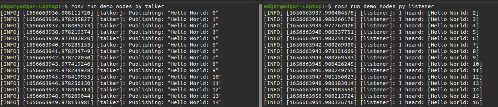

可以通过 ROS 2 的命令查看此时运行的节点的信息：

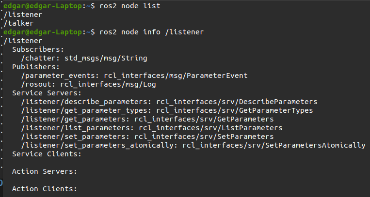

在ROS 2 中编写程序可以实现一个节点对另一个节点的控制, 例如: 可以使用以下命令启动一个模拟物体运动的节点:

```bash
ros2 run turtlesim turtlesim_node
```

再使用如下命令启动一个控制物体运动的节点:

```bash
ros2 run turtlesim turtle_teleop_key
```

两个节点之间可以相互通信, 实现对节点的控制:

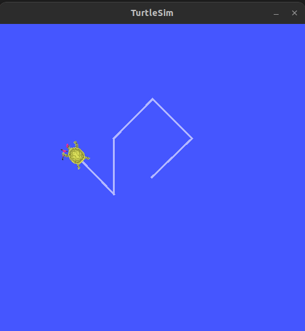

**Ray**环境的搭建

**完成单机版部署**  

安装 ray：  

```shell
pip3 install "ray[default]"
```

启动 head 节点：  

```shell
ray start --head --dashboard-host='0.0.0.0' --dashboard-port=8265
```

输出如下：  

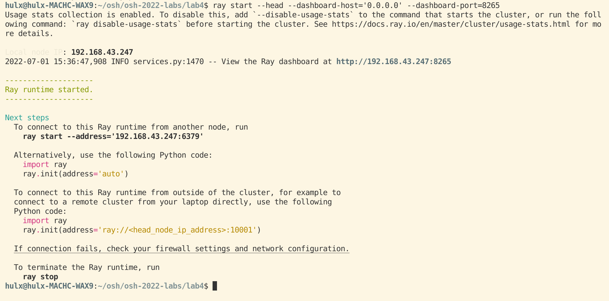

其中：  

web 服务的地址为：192.168.43.247:8265  
head 节点的地址：192.168.43.247:6379  

访问 dashboard：  

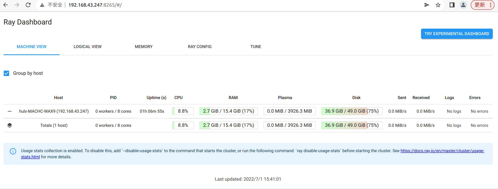

启动 worker 节点：  

```shell
ray start --address='192.168.43.247:6379'
```

输出如下： 

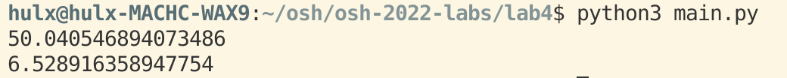

再次访问 Dashboard:

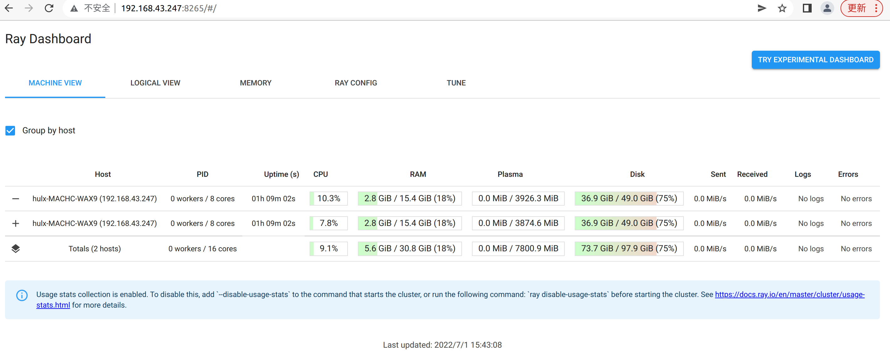

单机版部署完成  

**完成分布式部署**  

安装 ray：  

```shell
pip3 install "ray[default]"
```

启动 head 节点：  

```shell
ray start --head --dashboard-host='0.0.0.0' --dashboard-port=8265
```

输出如下：  

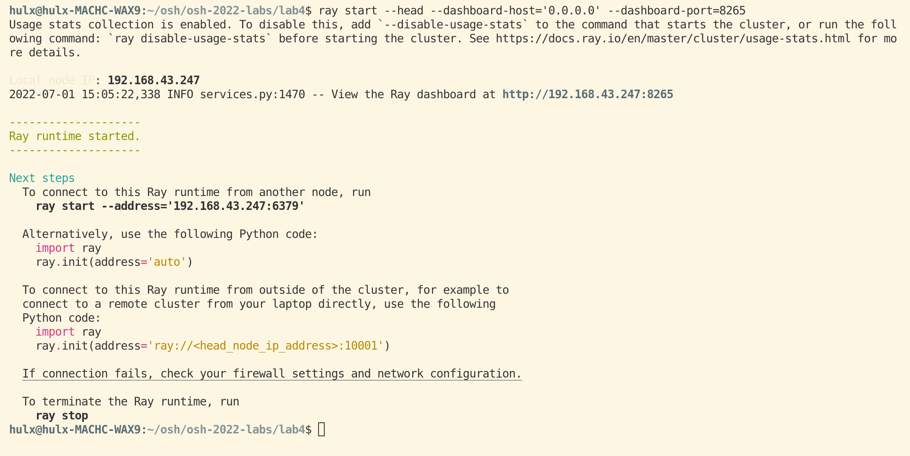

其中：  

web 服务的地址为：192.168.43.247:8265  
head 节点的地址：192.168.43.247:6379  

访问 dashboard：  

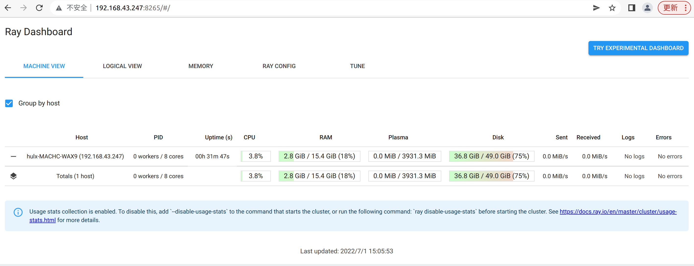

使用另一台电脑启动 worker 节点：  

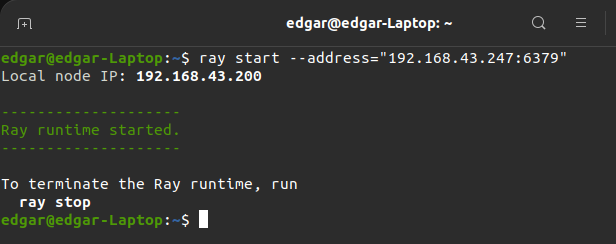

再次访问 dashboard：


部署完成.


## 4 测试结果

**矩阵乘法**

```python
from email.utils import collapse_rfc2231_value
import numpy as np
import time
import ray

ray.init(address="192.168.43.247:6379")

def f1():
    n = 1200
    a = np.random.randint(0, 10, (n, n))
    b = np.random.randint(0, 10, (n, n))
    c = a @ b

@ray.remote
def f2():
    n = 1200
    a = np.random.randint(0, 10, (n, n))
    b = np.random.randint(0, 10, (n, n))
    c = a @ b

time1=time.time()
[ f1() for _ in range(8)]
print(time.time()-time1)

time2=time.time()
ray.get([ f2.remote() for _ in range(8)])
print(time.time()-time2)
```

响应时间就是用户感受软件系统为其服务所耗费的时间，客户感受的响应时间其实是等于客户端响应时间+服务器端响应时间+网络响应.

**单机版性能测试**  

运行 `matrix_multiply.py`：  

```python
python3 matrix_multiply.py
```

运行时间：  

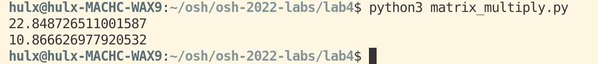

延迟和资源使用率（使用 dashboard 查看）：  

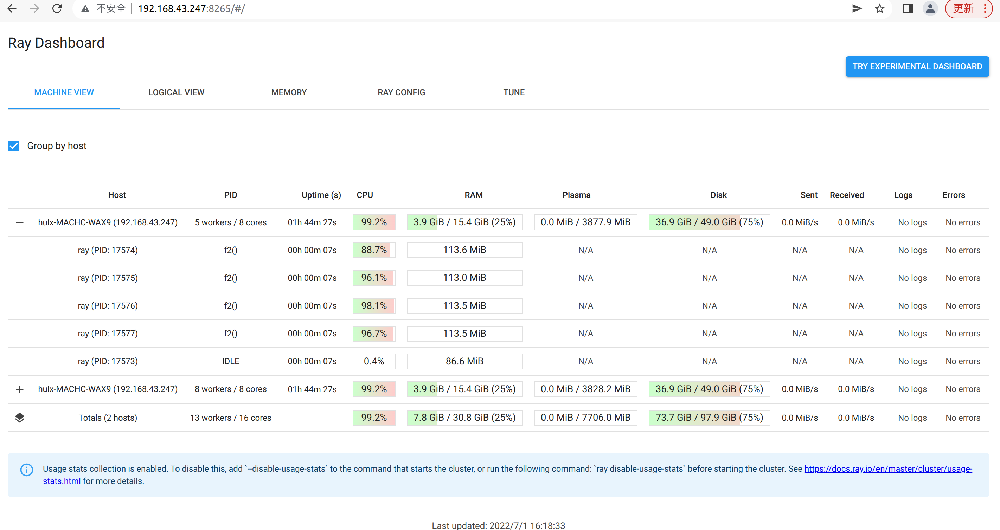

**基于已有部署进行分析，进行测试和优化**  

修改参数 `num_cpus`，即 `ray.init(num_cpus = n)`  

num_cpus = 2：  

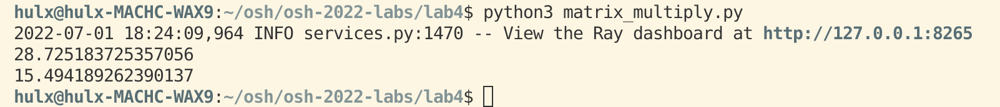

num_cpus = 4：  


num_cpus = 8：  

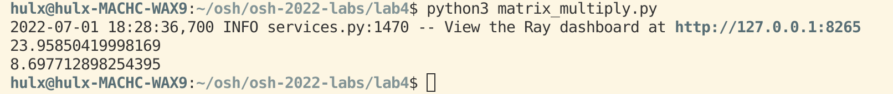

cpu 核数达到饱和  

**分布式性能测试**  

运行 `matrix_multiply.py`：  

```python
python3 matrix_multiply.py
```

运行时间（是单机版运行时间的 1/2）：  


延迟和资源使用率（使用 dashboard 查看）：  


