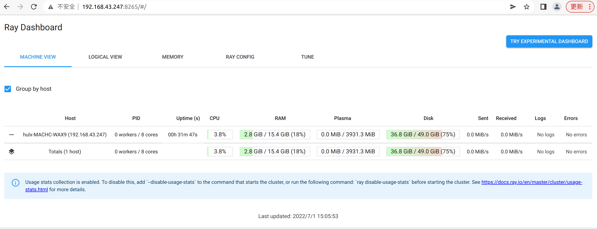

# 部署说明文档（ray）  

组员：  
- PB19000165 胡乐翔  
- PB20061251 田佳林  
- PB20051083 高弋超  
- PB20111718 朱仕哲  

**完成单机版部署**  

安装 ray：  

```shell
pip3 install "ray[default]"
```

启动 head 节点：  

```shell
ray start --head --dashboard-host='0.0.0.0' --dashboard-port=8265
```

输出如下：  


其中：  

web 服务的地址为：192.168.43.247:8265  
head 节点的地址：192.168.43.247:6379  

访问 dashboard：  


启动 worker 节点：  

```shell
ray start --address='192.168.43.247:6379'
```

输出如下：  


再次访问 dashboard：  


单机版部署完成  

**完成分布式部署**  

安装 ray：  

```shell
pip3 install "ray[default]"
```

启动 head 节点：  

```shell
ray start --head --dashboard-host='0.0.0.0' --dashboard-port=8265
```

输出如下：  


其中：  

web 服务的地址为：192.168.43.247:8265  
head 节点的地址：192.168.43.247:6379  

访问 dashboard：  



使用另一台电脑启动 worker 节点：  


再次访问 dashboard：  

  

分布式部署完成  