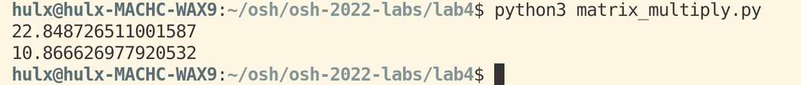
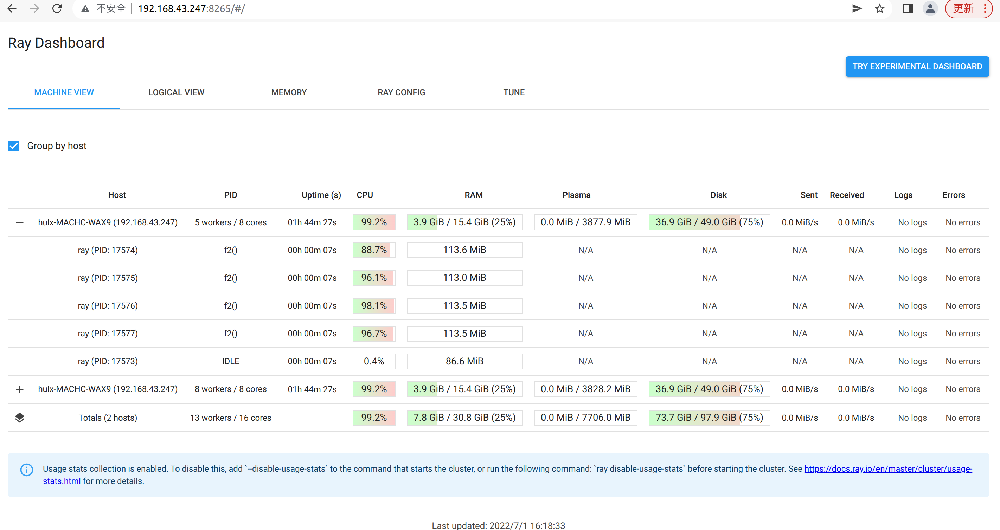
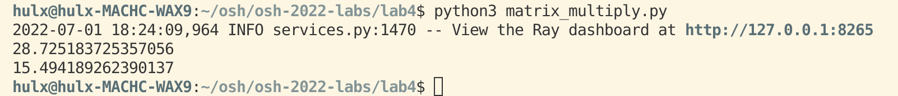
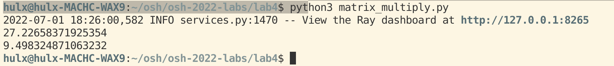
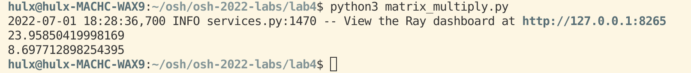
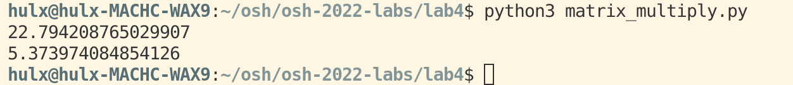
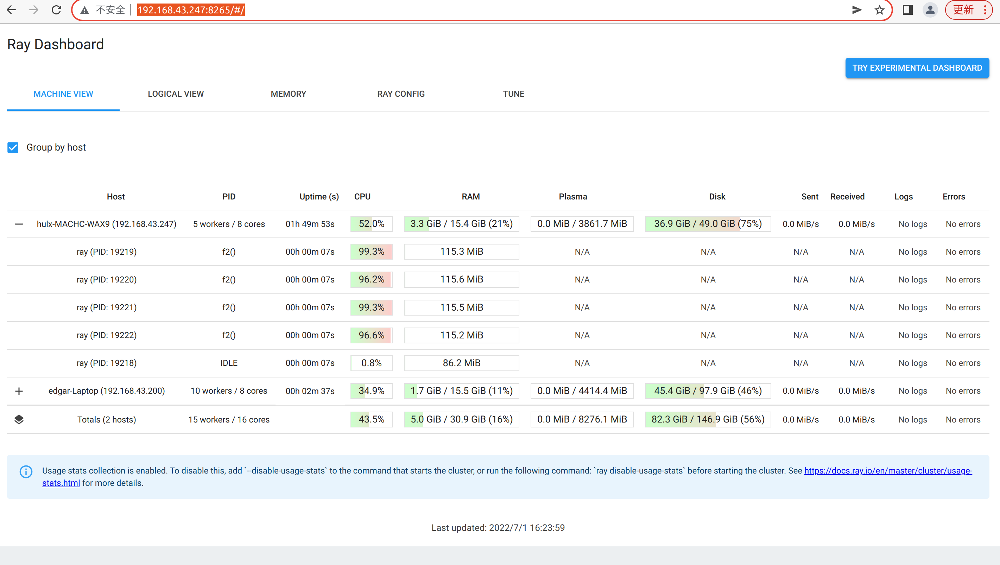

# 性能测试和分析文档  

组员：  
- PB19000165 胡乐翔  
- PB20061251 田佳林  
- PB20051083 高弋超  
- PB20111718 朱仕哲  

**选定一个与选题对应的计算类/存储类测试任务**  

矩阵乘法：  

`matrix_multiply.py`  

```python
from email.utils import collapse_rfc2231_value
import numpy as np
import time
import ray

ray.init(address="192.168.43.247:6379")

def f1():
    n = 1200
    a = np.random.randint(0, 10, (n, n))
    b = np.random.randint(0, 10, (n, n))
    c = a @ b

@ray.remote
def f2():
    n = 1200
    a = np.random.randint(0, 10, (n, n))
    b = np.random.randint(0, 10, (n, n))
    c = a @ b

time1=time.time()
[ f1() for _ in range(8)]
print(time.time()-time1)

time2=time.time()
ray.get([ f2.remote() for _ in range(8)])
print(time.time()-time2)
```

**拟定一份计算类/存储类对应的性能指标列表**  

- 响应时间  

响应时间就是用户感受软件系统为其服务所耗费的时间，客户感受的响应时间其实是等于客户端响应时间+服务器端响应时间+网络响应时间  

- 吞吐量  

软件系统在每单位时间内能处理多少个事务/请求/单位数据  

- CPU 使用率  
- RAM 使用率  
- Disk 使用率  

常见的资源使用率  

**单机版性能测试**  

运行 `matrix_multiply.py`：  

```python
python3 matrix_multiply.py
```

运行时间：  



延迟和资源使用率（使用 dashboard 查看）：  



**基于已有部署进行分析，进行测试和优化**  

修改参数 `num_cpus`，即 `ray.init(num_cpus = n)`  

num_cpus = 2：  



num_cpus = 4：  



num_cpus = 8：  



cpu 核数达到饱和  

**分布式性能测试**  

运行 `matrix_multiply.py`：  

```python
python3 matrix_multiply.py
```

运行时间（是单机版运行时间的 1/2）：  



延迟和资源使用率（使用 dashboard 查看）：  

